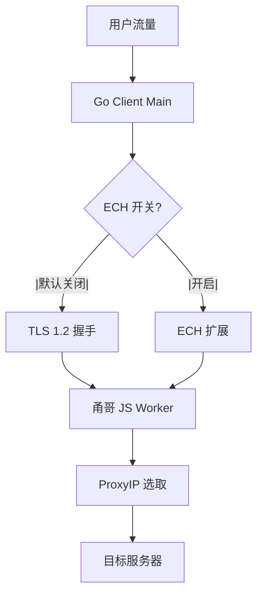
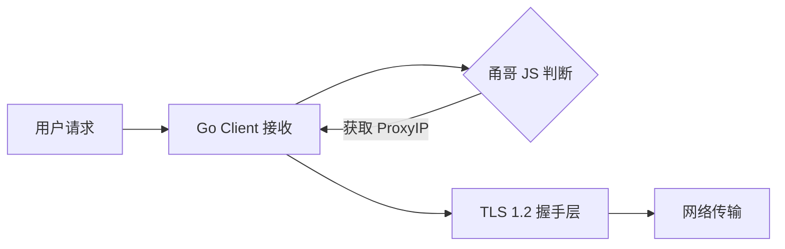

# [01] ech2-win7-client-gen: Win7客户端生成

## Product Overview

在 `ech2` 文件夹内生成并配置 Win7 版本的代理客户端代码。该客户端需兼容 Windows 7 系统，默认关闭 ECH (Encrypted Client Hello) 功能，强制使用 TLS 1.2 协议，并完整支持甬哥 JS 的 ProxyIP 功能，确保流量代理的高可用性与兼容性。

## 核心功能

- **Win7 客户端生成**：基于现有 Win7 代码库在 `ech2` 目录生成兼容代码
- **协议配置**：默认禁用 ECH，强制启用 TLS 1.2
- **ProxyIP 支持**：集成甬哥 JS 逻辑，支持动态代理 IP 切换
- **构建配置**：修改 `main.yml` 以支持 `ech2` 路径下的独立编译流程

## 技术栈

- **语言**: Go (Golang)
- **运行时目标**: Windows 7 (amd386/amd64)
- **网络协议**: TLS 1.2, HTTP/HTTPS Proxy
- **构建工具**: Go Build, YAML (CI/CD 配置)

## 架构设计

### 系统架构

系统采用客户端-代理架构，Go 程序作为主控进程，嵌入并调用 JavaScript 运行时执行 ProxyIP 逻辑。



### 模块划分

- **main.go**: 主入口，负责初始化配置、启动监听、管理 TLS 配置。
- **tls_config**: TLS 1.2 强制设置模块，处理 MinVersion 和 CipherSuites。
- **ech_handler**: ECH 控制逻辑（默认禁用）。
- **js_bridge**: Go 与 JavaScript (otto/goja) 的桥接层，用于调用甬哥脚本。
- **worker.js**: 甬哥 JS 脚本，负责 ProxyIP 的获取与轮换逻辑。

### 数据流



## 实现细节

### 目录结构

```
ech2/
├── cmd/
│   └── ech-win7-client/
│       └── main.go           # 主程序入口
├── internal/
│   ├── config/              # 配置加载与默认值设置
│   ├── net/                 # TLS 1.2 强制设置
│   └── proxy/               # 甬哥 JS 集成接口
├── assets/
│   └── _worker.js           # 甬哥 JS 脚本 (复制自 Win7 版本)
├── main.yml                 # 编译配置文件
└── go.mod
```

### 关键代码结构

```
// TLS 配置强制 TLS 1.2
func getDefaultTLSConfig() *tls.Config {
    return &tls.Config{
        MinVersion: tls.VersionTLS12,
        // ECH 默认禁用逻辑在配置层处理
    }
}

// 甬哥 JS 调用接口
type JSWorker struct {
    vm *otto.Runtime // or goja
}

func (w *JSWorker) GetProxyIP() (string, error) {
    // 调用 _worker.js 中的逻辑
}
```

### 技术实施计划

1. **问题**: 确保在 Windows 7 上 TLS 1.2 可用且 ECH 默认关闭。
- **方案**: 在 `tls.Config` 中显式设置 `MinVersion: tls.VersionTLS12`，并在配置文件中设置 `EnableECH: false`。

2. **问题**: 甬哥 JS 的兼容性。
- **方案**: 直接复用现有 `_worker.js`，确保 Go 侧的 JS VM 接口与原 Win7 版本一致。

3. **问题**: 构建系统适配 `ech2` 目录。
- **方案**: 修改 `main.yml`，将工作路径指向 `ech2`，并指定对应的输出目录。

### 集成点

- **Go <-> JS**: 通过 `otto` 或 `goja` 库传递代理请求和获取 IP 列表。
- **CI/CD**: `main.yml` 读取 `ech2` 目录下的 `main.go` 进行交叉编译。

## 技术考量

### 性能优化

- **JS 执行缓存**: 缓存编译后的 JS 虚拟机实例，避免重复初始化开销。
- **连接复用**: 在 TLS 1.2 层面尽可能复用连接。

### 安全性

- **TLS 1.2 安全套件**: 禁用弱密码套件，优先使用 ECDHE_RSA_AES_128_GCM_SHA256 等。
- **输入验证**: 对甬哥 JS 返回的 IP 进行格式校验，防止 SSRF。

### 可扩展性

- **配置热更新**: 支持运行时重载配置以切换 ProxyIP 策略。

### 开发流程

- **本地测试**: 在 Win7 虚拟机中测试 TLS 1.2 握手及代理连通性。
- **CI/CD**: 提交代码后自动触发 `main.yml` 进行编译打包。

## Agent Extensions

### SubAgent

- **code-explorer** (from <subagent>)
- Purpose: 探索现有的 ech2 和 Win7 相关代码结构，定位 `_worker.js` 和 `main.yml` 的具体位置
- Expected outcome: 明确现有代码文件路径及依赖关系，为生成新代码提供依据
