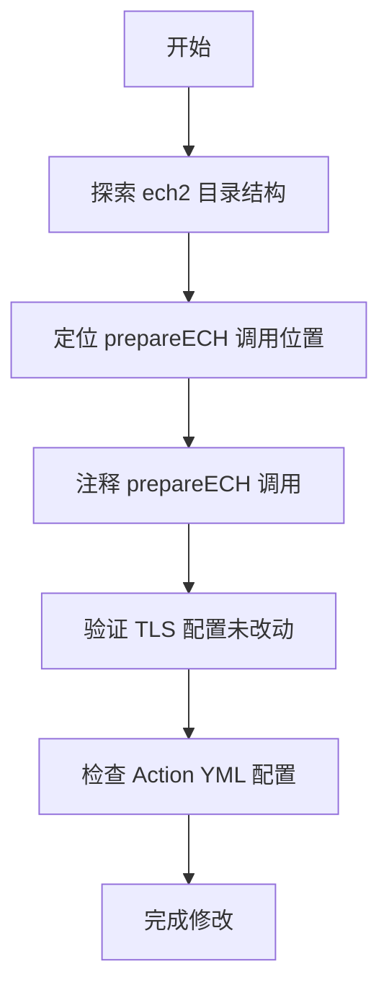

# [02] ech2-win7-no-ech: 禁用ECH扩展

## Product Overview

在 ech2 文件夹内构建 Win7 版本客户端，通过注释掉 prepareECH() 函数调用来禁用 ECH (Encrypted Client Hello) 功能，同时保持标准 TLS 1.3/1.2 协议配置不变。其他代码逻辑保持原样，以确保客户端稳定性和兼容性。

## Core Features

- 在 ech2 目录生成适配 Win7 的客户端代码
- 注释 prepareECH() 调用以禁用 ECH 功能
- 保持 TLS 版本配置不变 (TLS 1.3/1.2)
- 确保其他代码逻辑完全一致
- 评估并验证 GitHub Action 配置的可行性

## Tech Stack

- **基础环境**: 基于现有仓库 (ech-win7-repo)
- **编译目标**: Windows 7 兼容版本
- **修改范围**: 源代码级别的函数调用注释
- **CI/CD**: GitHub Actions (需评估现有配置)

## 架构设计

### 系统架构

该项目属于源码修改任务，主要涉及对现有代码库的特定函数调用进行注释处理。


### 修改流程



### 关键技术点

1. **代码搜索**: 精准定位 prepareECH 函数的所有调用点
2. **代码修改**: 注释而非删除，保留代码恢复能力
3. **配置验证**: 确保 TLS 版本相关宏/配置未受影响
4. **CI 评估**: 检查 GitHub Actions 工作流对 Win7 构建的支持

## 实现细节

### 核心修改操作

主要任务是对源代码进行精确的字符串匹配和注释操作：

```c
// 修改前
prepareECH();

// 修改后
// prepareECH(); // Disable ECH for Win7 compatibility
```

### 目录结构探索

需要使用代码探索工具扫描 ech2 目录：

```
ech2/
├── src/
│   ├── core/
│   └── tls/
├── build/
└── .github/
    └── workflows/
```

### 技术实施计划

1. **探索代码库**: 使用 [subagent:code-explorer] 扫描 ech2 目录，定位所有包含 prepareECH 的文件
2. **分析调用点**: 确认 prepareECH 的调用上下文，确保注释不会影响其他逻辑
3. **执行修改**: 对定位到的调用点进行注释处理
4. **验证完整性**: 检查 TLS 相关配置文件和宏定义未被修改
5. **评估 CI**: 检查 .github/workflows 下的配置是否支持 Win7 构建

## Agent Extensions

### SubAgent

- **code-explorer** (from <subagent>)
- Purpose: 扫描 ech2 目录结构，定位所有包含 prepareECH 函数调用的源文件
- Expected outcome: 找到所有需要修改的文件路径和具体行号，确保无遗漏
