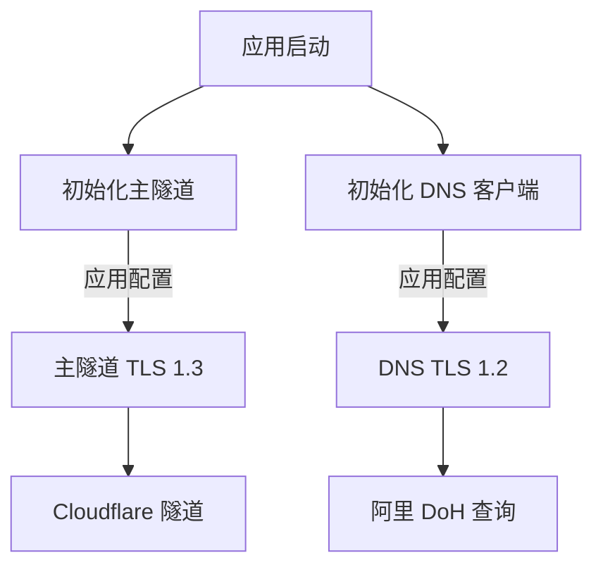
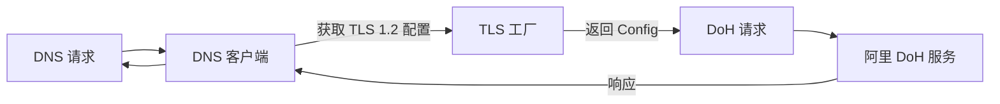

# [03] tls-dns-precision-downgrade: DNS TLS精准降级

## Product Overview

实现 DNS 查询的精准 TLS 版本降级机制，确保在 Windows 7 环境下阿里 DoH 的兼容性，同时保持主隧道的高性能 TLS 1.3 连接。

## Core Features

- 新增独立的 DNS TLS 配置函数，支持指定 TLS 1.2 版本
- 修改 DNS 查询逻辑，使其应用专用 TLS 1.2 配置
- 确保主隧道连接继续使用 TLS 1.3 配置，互不干扰
- 提供配置隔离，避免全局 TLS 设置冲突

## Tech Stack

- **语言**: Go (Golang)
- **核心库**: `crypto/tls`, `net`
- **架构模式**: 配置隔离与策略模式

## Architecture Design

### System Architecture



### Module Division

- **Main Tunnel Module**: 负责与 Cloudflare 的核心连接，使用 TLS 1.3。
- **DNS Client Module**: 负责处理 DNS over HTTPS 查询，使用 TLS 1.2。
- **TLS Config Factory**: 工厂函数，根据用途生成不同的 TLS 配置。

### Data Flow



### Key Code Structures

```
// 专用 DNS TLS 配置生成函数
func GetDNS_TLSConfig() *tls.Config {
    return &tls.Config{
        MinVersion: tls.VersionTLS12,
        MaxVersion: tls.VersionTLS12,
        // 其他兼容性配置...
    }
}

// DNS 客户端结构体
type DNSClient struct {
    httpClient *http.Client
    // 使用 GetDNS_TLSConfig() 初始化 Transport
}
```

### Technical Implementation Plan

1. **隔离 TLS 配置**: 创建独立的 `GetDNS_TLSConfig` 函数，强制锁定 TLS 1.2。
2. **注入 DNS 客户端**: 修改现有 DNS 查询代码，在初始化 HTTP Client 时传入上述配置。
3. **验证主隧道**: 确保主隧道初始化代码未受影响，继续使用全局或专用的高版本 TLS 配置。
4. **兼容性测试**: 在 Windows 7 环境下验证 DNS 解析功能正常。

## Agent Extensions

### SubAgent

- **code-explorer** (from <subagent>)
- Purpose: 探索代码库以定位 DNS 查询、TLS 配置及主隧道初始化的具体代码位置。
- Expected outcome: 确定需要修改的文件和函数列表，明确代码注入点。
