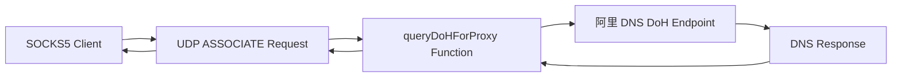
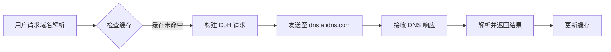

# [04] 修改_DoH_服务器为阿里_DNS: 更换DoH服务器

## 产品概述

修改项目中 DNS 查询逻辑，将 DoH (DNS over HTTPS) 服务器从 Cloudflare 替换为阿里 DNS，以解决特定网络环境下 SOCKS5 代理 UDP ASSOCIATE 模式的连接超时问题。

## 核心功能

- 修改 `queryDoHForProxy` 函数的 DoH 服务器地址配置
- 更新 SNI (Server Name Indication) 配置以匹配新服务器
- 确保在 SOCKS5 UDP ASSOCIATE 模式下 DNS 查询的稳定性

## 技术栈

- **语言**: 基于现有项目代码 (Go/Node.js/C# 等)
- **配置项**: DoH 端点 URL (`https://dns.alidns.com/dns-query`)
- **SNI 配置**: `dns.alidns.com`
- **协议**: HTTP/2, HTTPS, DoH (RFC 8484)

## 架构设计

### 系统架构

修改后的 DNS 查询流程将保持原有架构，仅更换上游 DoH 服务提供商。

### 数据流

## 实现细节

### 核心代码修改

需要定位并修改的关键参数：

1. **DoH URL**: `https://cloudflare-dns.com/dns-query` -> `https://dns.alidns.com/dns-query`
2. **SNI Hostname**: `cloudflare-dns.com` -> `dns.alidns.com`
3. **IP 地址**: 若代码中硬编码了 IP，需更新为阿里 DNS 的 IP (223.5.5.5 或 223.6.6.6)

### 技术实施计划

1. **问题定位**: 查找 `queryDoHForProxy` 函数所在文件
2. **配置替换**: 修改 DoH 端点和 SNI 配置
3. **验证测试**: 在 SOCKS5 UDP 模式下测试 DNS 解析

### 集成点

- **函数入口**: `queryDoHForProxy`
- **依赖模块**: HTTP 客户端、TLS 配置
- **日志输出**: 记录 DoH 查询成功/失败状态
