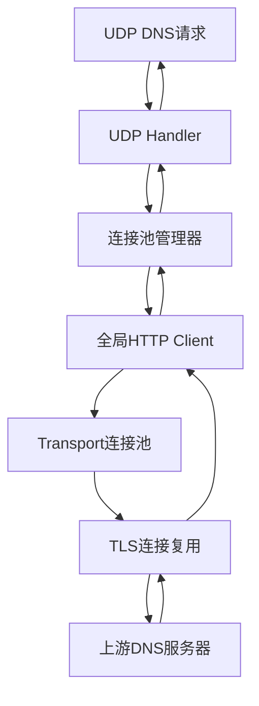
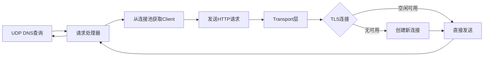

# [05] 优化UDP_DNS代理连接池: 连接池优化

## 产品概述

为UDP DNS代理服务实现全局HTTP Client连接池优化，解决Windows 7环境下频繁创建TLS连接导致的socket耗尽和CPU过载问题。

## 核心功能

- 实现全局HTTP Client连接池，复用TCP连接
- 配置Transport参数，设置MaxIdleConnsPerHost控制并发连接数
- 优化TLS握手开销，提升DNS查询性能
- 添加连接池监控和健康检查机制
- 支持动态调整连接池大小参数

## 技术栈

- 编程语言: Go (golang)
- HTTP Client: 标准库 net/http
- 传输层配置: http.Transport
- 并发控制: MaxIdleConnsPerHost参数

## 系统架构

### 架构图



### 模块划分

- **连接池模块**: 负责HTTP Client初始化和配置
- **Transport配置**: 管理TCP/TLS连接池参数
- **请求处理**: UDP请求转发到HTTP层的逻辑
- **监控模块**: 连接池状态监控和统计

### 数据流



## 核心目录结构

```
ech-win7-repo/
├── internal/
│   ├── proxy/              # 代理核心逻辑
│   │   ├── pool.go         # 连接池管理
│   │   ├── transport.go    # Transport配置
│   │   └── handler.go      # UDP请求处理
│   └── config/             # 配置管理
├── pkg/
│   └── httpclient/         # HTTP Client封装
└── main.go
```

## 关键代码结构

### 连接池配置

```
type PoolConfig struct {
    MaxIdleConns        int
    MaxIdleConnsPerHost int
    IdleConnTimeout     time.Duration
    TLSHandshakeTimeout time.Duration
}

type ConnectionPool struct {
    client   *http.Client
    config   *PoolConfig
    stats    *PoolStats
}
```

### API接口

```
// 初始化全局连接池
func InitGlobalPool(config *PoolConfig) (*ConnectionPool, error)

// 获取HTTP Client实例
func (p *ConnectionPool) GetClient() *http.Client

// 更新连接池配置
func (p *ConnectionPool) UpdateConfig(newConfig *PoolConfig) error

// 获取连接池统计信息
func (p *ConnectionPool) GetStats() *PoolStats
```

## 技术实现方案

### 问题1: Windows 7下Socket耗尽

- **解决方案**: 实现连接池复用TCP连接，减少新建连接数量
- **关键配置**: MaxIdleConnsPerHost=10, MaxIdleConns=100
- **实现步骤**:

1. 创建全局http.Transport实例
2. 配置连接池参数
3. 使用sync.Pool管理Client实例

### 问题2: 频繁TLS握手导致CPU过载

- **解决方案**: 复用TLS连接，避免重复握手
- **关键技术**: Keep-Alive机制, TLS Session Resumption
- **实现步骤**:

1. 设置DisableKeepAlives=false
2. 配置合理的IdleConnTimeout
3. 启用TLS握手缓存

### 集成点

- 与现有UDP Handler集成，替换原有每次创建Client的逻辑
- 配置热加载机制，支持运行时调整参数
- 监控指标导出到Prometheus

## 技术考虑

### 性能优化

- 连接复用减少TCP握手和TLS握手开销
- 控制并发连接数避免资源耗尽
- 定期清理空闲连接防止内存泄漏

### 安全措施

- 验证上游DNS服务器证书
- 配置合理的超时参数防止DoS攻击
- 连接数上限控制

### 可扩展性

- 支持动态调整连接池大小
- 可配置的上游服务器列表
- 插件化的监控接口

### 开发流程

1. 使用code-explorer探索现有代码结构
2. 实现连接池管理模块
3. 集成到UDP处理流程
4. 单元测试和性能测试
5. 部署验证

## Agent Extensions

### SubAgent

- **code-explorer**
- Purpose: 探索ech-win7-repo代码库，理解现有的UDP DNS代理实现架构，定位HTTP Client使用位置和相关配置
- Expected outcome: 获得项目代码结构图，找到需要优化的关键文件和函数，了解当前的HTTP Client创建和使用方式
