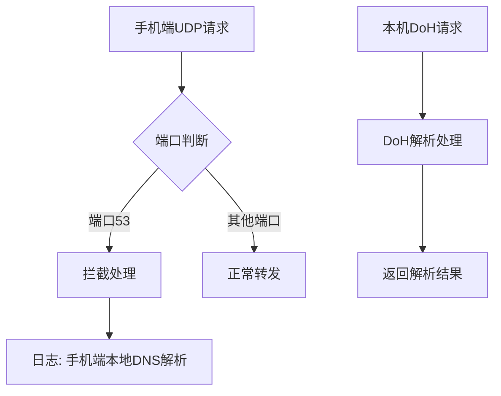
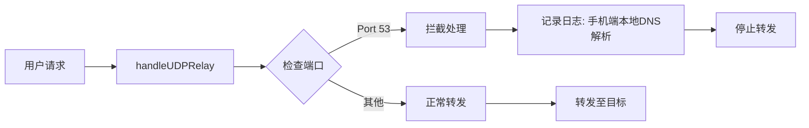

# [06] go-client-dns-intercept-plan: DNS请求拦截

## Product Overview

将Go客户端改造成流量分流稳定版，实现手机端UDP/DNS请求拦截（端口53），同时保留本机DoH解析能力。删除冗余的DNS二进制转换代码，优化日志提示以提高兼容性。

## Core Features

- 在handleUDPRelay中拦截53端口DNS请求，实现手机端流量隔离
- 保留本机DoH解析能力，确保本地DNS正常工作
- 删除handleDNSQuery、buildDNSQuery、parseDNSResponse、parseHTTPSRecord等冗余函数
- 清理未使用的encoding/binary import
- 优化日志提示，使用"手机端本地DNS解析"替代"丢弃"描述，提升用户体验

## Tech Stack

- **编程语言**: Go
- **网络协议**: UDP、DNS协议
- **日志系统**: 标准日志库（如log或结构化日志库）

## Architecture Design

### System Architecture



### Module Division

- **UDP Relay Module**: 负责处理UDP流量转发，包含端口拦截逻辑
- **DoH Module**: 负责本机DNS-over-HTTPS解析
- **Logging Module**: 统一日志输出，优化提示文案

### Data Flow



## Implementation Details

### Key Code Structures

```
// 主要修改点: handleUDPRelay函数
func handleUDPRelay(conn *net.UDPConn, targetAddr *net.UDPAddr) {
    // 检查端口是否为53
    if conn.LocalAddr().(*net.UDPAddr).Port == 53 {
        log.Println("手机端本地DNS解析，已拦截")
        return
    }
    // 正常转发逻辑
    ...
}

// 删除的冗余函数列表:
// - handleDNSQuery
// - buildDNSQuery
// - parseDNSResponse
// - parseHTTPSRecord
```

### Technical Implementation Plan

1. **问题**: 手机端DNS请求需要拦截但不能影响本机DoH
**解决方案**: 在handleUDPRelay入口处添加端口53判断逻辑
**步骤**:

- 修改handleUDPRelay函数
- 添加端口检查
- 输出友好日志后return

2. **问题**: 代码冗余需要清理
**解决方案**: 删除未使用的DNS二进制处理函数和import
**步骤**:

- 使用[subagent:code-explorer]查找所有函数引用
- 确认无引用后删除冗余函数
- 清理encoding/binary import

3. **问题**: 日志提示不友好
**解决方案**: 优化日志文案，使用"本地DNS解析"术语
**步骤**:

- 搜索所有"丢弃"相关日志
- 替换为"手机端本地DNS解析"

## Technical Considerations

### Performance Optimization

- 端口判断在函数入口处执行，最小化性能开销
- 日志输出使用条件编译或日志级别控制，生产环境可关闭

### Development Workflow

- 1. 使用[subagent:code-explorer]探索现有代码结构
- 2. 修改handleUDPRelay实现拦截逻辑
- 3. 删除冗余函数和import
- 4. 优化日志文案
- 5. 编译测试验证功能

## Agent Extensions

### SubAgent

- **code-explorer**
- Purpose: 探索现有Go代码仓库，查找handleUDPRelay函数位置、冗余函数引用情况以及encoding/binary import的使用位置
- Expected outcome: 获取完整的代码结构信息和依赖关系，确保安全删除冗余代码
