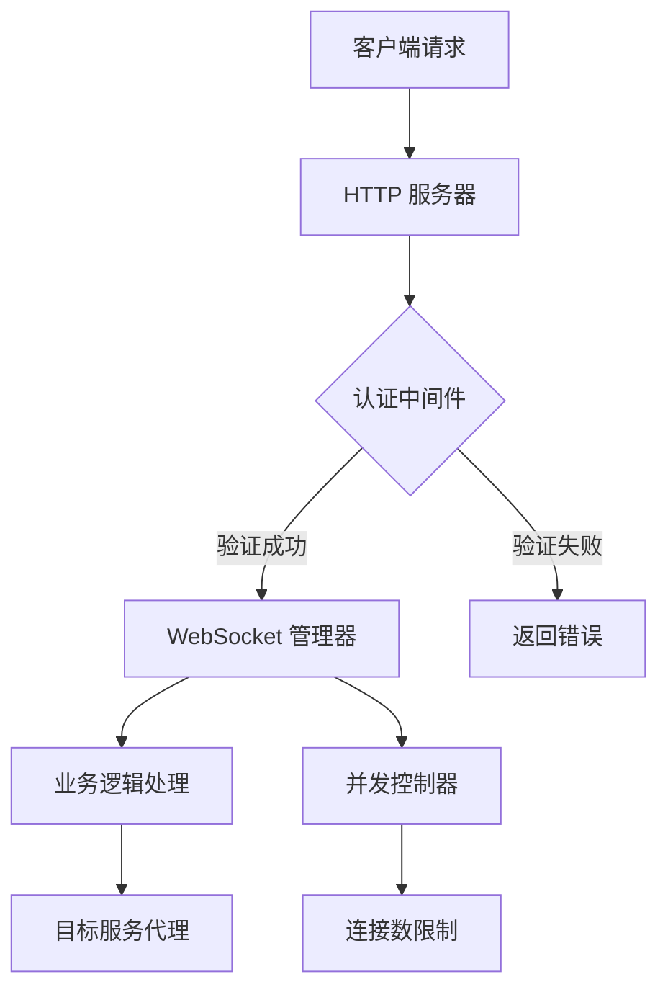
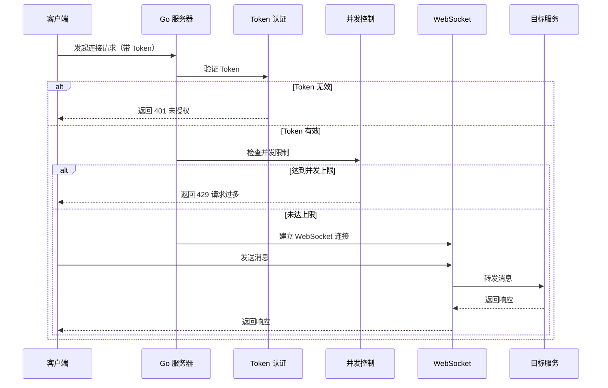

## Product Overview

创建 Go 语言版本的 ClawCloud 服务端，用于替代原有的 JavaScript 版本。该服务端将实现 WebSocket 代理、Token 认证、并发控制等核心功能，并通过 Docker 容器化和 GitHub Actions 自动化部署到 ClawCloud Run 环境。

## Core Features

- WebSocket 代理服务：支持实时双向通信和消息转发
- Token 认证机制：基于 Token 的身份验证，确保安全性
- 并发控制：连接数限制和请求限流，防止资源耗尽
- Docker 容器化：标准化部署流程，易于扩展和管理
- GitHub Actions CI/CD：自动化构建、测试和部署流程

## 技术栈

- 后端语言：Go 1.21+
- 容器化：Docker
- CI/CD：GitHub Actions
- WebSocket 库：gorilla/websocket
- HTTP 路由：gin-gonic/gin
- 配置管理：viper

## 技术架构

### 系统架构

架构模式：分层架构（接入层、业务逻辑层、数据层）
主要组件：HTTP 服务器、WebSocket 管理器、认证中间件、并发控制器



### 模块划分

- **服务器模块**：HTTP 服务启动、路由注册；关键库：gin；依赖：认证模块、WebSocket 模块
- **WebSocket 模块**：WebSocket 连接管理、消息转发；关键库：gorilla/websocket；依赖：认证模块、并发控制模块
- **认证模块**：Token 验证、身份识别；关键库：JWT；依赖：配置模块
- **并发控制模块**：连接数统计、限流控制；关键库：channel、sync 包；依赖：配置模块

### 数据流

客户端连接请求 → Token 验证 → 并发控制检查 → 建立 WebSocket 连接 → 消息代理转发 → 响应返回客户端



## 实现细节

### 核心目录结构

```
clawcloud-go-server/
├── ech3/                  # 主项目目录
│   ├── cmd/
│   │   └── server/        # 应用入口
│   │       └── main.go    # 主程序文件
│   ├── internal/
│   │   ├── auth/          # 认证模块
│   │   │   └── auth.go
│   │   ├── websocket/     # WebSocket 模块
│   │   │   └── websocket.go
│   │   ├── middleware/    # 中间件
│   │   │   └── auth.go
│   │   └── config/        # 配置管理
│   │       └── config.go
│   ├── Dockerfile         # Docker 配置
│   ├── go.mod             # Go 模块定义
│   └── go.sum             # 依赖锁定文件
└── .github/
    └── workflows/
        └── deploy.yml     # GitHub Actions 工作流
```

### 关键代码结构

**ServerConfig 结构体**：服务器配置定义

```
type ServerConfig struct {
    Port         int    `mapstructure:"port"`
    SecretKey    string `mapstructure:"secret_key"`
    MaxConn      int    `mapstructure:"max_conn"`
    TargetURL    string `mapstructure:"target_url"`
}
```

**WebSocketClient 结构体**：WebSocket 客户端连接封装

```
type WebSocketClient struct {
    ID     string
    Conn   *websocket.Conn
    Send   chan []byte
    Server *WebSocketServer
}
```

**AuthMiddleware 中间件**：HTTP 请求认证拦截器

```
func AuthMiddleware() gin.HandlerFunc {
    return func(c *gin.Context) {
        token := c.GetHeader("Authorization")
        if !ValidateToken(token) {
            c.AbortWithStatusJSON(401, gin.H{"error": "Unauthorized"})
            return
        }
        c.Next()
    }
}
```

### 技术实现方案

#### 1. WebSocket 代理实现

**问题**：实现高性能的 WebSocket 消息代理转发
**解决方案**：使用 gorilla/websocket 库，每个连接使用独立 goroutine 处理
**步骤**：建立 WebSocket 升级处理器 → 为每个连接创建读写协程 → 实现消息转发逻辑

#### 2. Token 认证实现

**问题**：安全验证客户端身份
**解决方案**：使用 JWT 进行 Token 生成和验证
**步骤**：实现 Token 生成函数 → 实现 Token 验证中间件 → 配置 Token 过期时间

#### 3. 并发控制实现

**问题**：限制同时连接数，防止资源耗尽
**解决方案**：使用 channel 信号量模式控制并发数
**步骤**：创建带缓冲的 channel 作为信号量 → 连接建立时获取信号量 → 连接断开时释放信号量

### 集成点

- **认证模块**：与 WebSocket 模块通过中间件集成
- **并发控制**：在 WebSocket 连接建立前进行拦截
- **目标服务**：通过 HTTP Client 进行消息转发
- **配置管理**：通过环境变量注入配置参数

## Agent Extensions

### SubAgent

- **code-explorer**
- 目的：探索现有 JavaScript 服务端代码，理解其功能实现细节
- 预期结果：获取 JS 版本的 WebSocket 代理逻辑、Token 认证机制和并发控制策略，为 Go 版本实现提供参考