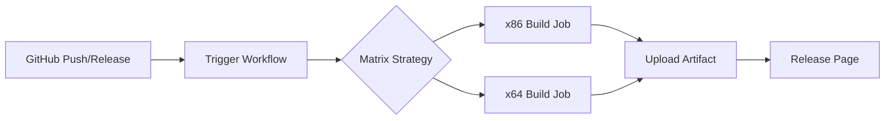

## Product Overview

修改 GitHub Actions 工作流配置以支持多架构构建。

## Core Features

- 配置矩阵构建策略，同时编译 x86 和 x64 两个版本
- 针对 Windows 7 平台优化构建参数
- 自动发布双架构产物到 Release 页面

## Tech Stack

- CI/CD 工具: GitHub Actions (YAML)
- 构建平台: Windows Server (msvc)
- 目标架构: x86 (32位), x64 (64位)

## Tech Architecture

### System Architecture

- 架构模式: 矩阵构建策略 (Matrix Build Strategy)
- 构建流程: 代码检出 → 环境配置 → 编译 → 产物上传



### Module Division

- **构建配置模块**: `.github/workflows/*.yml` - 定义构建矩阵和步骤
- **编译模块**: MSVC 编译器配置，区分目标架构
- **发布模块**: 自动上传构建产物到 Release

### Data Flow

GitHub 触发事件 → 矩阵策略分发任务 → 并行执行 x86/x64 构建 → 收集构建产物 → 发布到 Release

## Implementation Details

### Core Directory Structure

```
project-root/
└── .github/
    └── workflows/
        └── build.yml  # 修改: 添加 x86 构建配置
```

### Key Code Structures

**Matrix 策略配置**: 定义并行构建的架构矩阵

```
strategy:
  matrix:
    target: [x86, x64]
    include:
      - target: x86
        platform: Win32
        arch: -arch:IA32
      - target: x64
        platform: x64
        arch: -arch:AMD64
```

**构建步骤配置**: 根据架构动态设置编译参数

```
- name: Build
  run: |
    cmake -G "Visual Studio 16 2019" -A ${{ matrix.platform }}
    cmake --build . --config Release ${{ matrix.arch }}
```

### Technical Implementation Plan

1. **添加 x86 构建支持**: 在 matrix 策略中新增 x86 目标配置
2. **配置编译参数**: 为 x86 和 x64 分别设置正确的 MSVC 架构参数
3. **产物命名优化**: 区分 x86 和 x64 的输出文件名
4. **Release 配置**: 确保双架构产物都能正确上传到 Release 页面

### Integration Points

- **GitHub Actions**: 使用 YAML 配置定义 CI/CD 流程
- **MSVC 编译器**: 通过 `-arch` 参数指定目标架构
- **GitHub Releases**: 使用 `softprops/action-gh-release` 等自动发布工具

## Agent Extensions

### SubAgent

- **code-explorer**
- Purpose: 探索现有 GitHub Actions 配置文件结构
- Expected outcome: 确认当前构建配置位置和具体内容，为修改提供依据